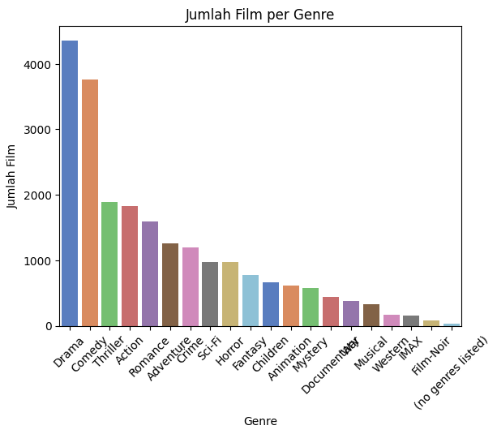
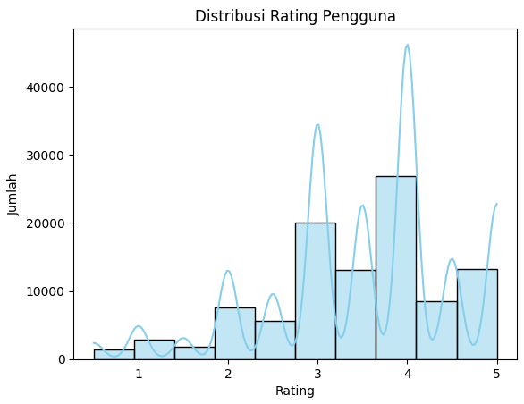

# Laporan Proyek Machine Learning - Elfin Darmawan

## Project Overview

Sistem rekomendasi telah menjadi bagian penting dalam berbagai platform digital untuk meningkatkan pengalaman pengguna. Proyek ini berfokus pada pengembangan sistem rekomendasi film dengan menggunakan dataset MovieLens Small Latest Dataset. Tujuan dari sistem ini adalah untuk menyarankan film yang relevan kepada pengguna berdasarkan preferensi dan riwayat rating mereka.

Dalam era digital saat ini, konsumen dihadapkan pada pilihan film yang sangat banyak, baik melalui platform streaming maupun layanan digital lainnya. Tanpa bantuan sistem rekomendasi, konsumen akan kesulitan menemukan film yang sesuai dengan preferensinya. Oleh karena itu, sistem rekomendasi menjadi solusi penting untuk membantu pengguna menemukan film yang relevan dan menarik.

### Mengapa Proyek Ini Penting?

- Membantu pengguna menemukan film yang sesuai selera mereka dari ribuan pilihan.
- Menyediakan pengalaman pengguna yang lebih baik dan personal.
- Menyarankan film-film berdasarkan preferensi pengguna

### Referensi:

Ricci, F., Rokach, L., & Shapira, B. (2011). Introduction to Recommender Systems Handbook.

Movielens Dataset (GroupLens Research): https://grouplens.org/datasets/movielens/

## Business Understanding
### Problem Statements

Pengguna sering kali kesulitan memilih film yang sesuai dengan preferensi mereka karena banyaknya pilihan yang tersedia. Diperlukan sistem yang mampu merekomendasikan film secara akurat berdasarkan kemiripan isi film dan minat pengguna.

### Goals

Membangun sistem rekomendasi yang mampu memberikan Top-N rekomendasi film yang sesuai dengan minat pengguna secara otomatis dan personal.

### Solution statements

Proyek ini mengimplementasikan dua pendekatan:
- **Content-Based Filtering (TF-IDF + Cosine Similarity)**
Menggunakan informasi genre dari film untuk merekomendasikan film serupa berdasarkan kesukaan pengguna.
- **Collaborative Filtering (Neural Network-based Embedding Model)**
Menggunakan data rating untuk menemukan hubungan antar pengguna dan item untuk menampilkan rekomendasi film yang kemungkinan akan disukai oleh pengguna berdasarkan rating.


## Data Understanding

Dataset yang digunakan dalam proyek ini adalah MovieLens Small Latest Dataset, yang merupakan salah satu dataset benchmark populer untuk membangun dan mengevaluasi sistem rekomendasi. Dataset ini terdiri dari beberapa file utama, yaitu movies.csv, ratings.csv, links.csv, tags.csv. Tapi disini kita hanya menggunakan 2 dataset yaitu movies dan ratings.

Dataset: https://www.kaggle.com/datasets/shubhammehta21/movie-lens-small-latest-dataset

### Variabel-variabel pada `movies.csv` dataset adalah sebagai berikut:
**Terdiri dari `9.742 baris` dan `3 kolom`**

Berisi daftar film yang mencakup:
- `movieId`: ID unik untuk setiap film.
- `title`: Judul film beserta tahun rilis.
- `genres`: Daftar genre film yang dipisahkan oleh tanda pipe (|), seperti Action|Adventure|Sci-Fi.
       
### Variabel-variabel pada `ratings.csv` dataset adalah sebagai berikut:
**Terdiri dari `100.836 baris` dan `4 kolom`**

Berisi data penilaian yang diberikan pengguna terhadap film. Setiap entri menunjukkan interaksi pengguna dengan suatu film:
- `userId`: ID pengguna.
- `movieId`: ID film.
- `rating`: Nilai rating yang diberikan (skala 0.5 hingga 5.0).
- `timestamp`: Waktu rating diberikan (dalam UNIX time).

### Exploratory Data Analysis (EDA)
#### Movies Variabel
- Menampilkan 10 data awal dari dataframe movies menggunakan `.head(10)`
```
     movieId	        title	                                        genres
0	1	Toy Story (1995)	                Adventure|Animation|Children|Comedy|Fantasy
1	2	Jumanji (1995)	                        Adventure|Children|Fantasy
2	3	Grumpier Old Men (1995)	                Comedy|Romance
3	4	Waiting to Exhale (1995)	        Comedy|Drama|Romance
4	5	Father of the Bride Part II (1995)	Comedy
5	6	Heat (1995)	                        Action|Crime|Thriller
6	7	Sabrina (1995)	                        Comedy|Romance
7	8	Tom and Huck (1995)	                Adventure|Children
8	9	Sudden Death (1995)	                Action
9	10	GoldenEye (1995)	                Action|Adventure|Thriller
```
Tabel diatas merupakan isi dari dataset `movie.csv` dengan menampilkan 10 data awal dari dataset tersebut.

- Menampilkan dan mengecek informasi umum dataset menggunakan `.info`
```
<class 'pandas.core.frame.DataFrame'>
RangeIndex: 9742 entries, 0 to 9741
Data columns (total 3 columns):
 #   Column   Non-Null Count  Dtype 
---  ------   --------------  ----- 
 0   movieId  9742 non-null   int64 
 1   title    9742 non-null   object
 2   genres   9742 non-null   object
dtypes: int64(1), object(2)
memory usage: 228.5+ KB
```
Pada setiap kolom tertera 9742 non-null, yang menunjukan bahwa tidak ada nilai yang hilang atau mising value pada dataset. Kolom `movieId` memiliki tipe data integer, sedangkan `title` dan `genres` memiliki tipe data object.

- Melihat statistik deskriptif dari dataset menggunakan `.describe`
```bash
          movieId
count	9742.000000
mean	42200.353623
std	52160.494854
min	1.000000
25%	3248.250000
50%	7300.000000
75%	76232.000000
max	193609.000000
```
Karena dalam dataset `movies` hanya kolom `movieId` yang bersifat numerik, maka outputnya hanya menampilkan statistik untuk kolom tersebut. Terlihat nilai tengah, standar deviasi, minimal dan maximal untuk kolom `movieId`.

- Mengecek Missing Value dan data duplikat menggunakan `.isnull().sum()` dan `.duplicated().sum()`
```bash
        0
movieId	0
title	0
genres	0
dtype: int64 
```
Dari pengecekan tersebut terlihat bahwa tidak ada nilai null atau kosong dari dataframe movies

```bash
Jumlah data duplikat: 0
```
Mengecek data duplikat pada dataframe movies dan hasilnya adalah tidak ada data duplikat

- Distribusi Jumlah Film tiap genre



Dari plot ini, kita bisa melihat genre-genre yang paling populer (memiliki jumlah film terbanyak) seperti Drama dan Comedy, hingga genre yang paling jarang seperti Film-Noir dan (no genres listed). Plot ini memberikan gambaran visual tentang komposisi genre dalam dataset film.

#### Ratings Variabel
- Menampilkan 10 data awal dari dataframe ratings menggunakan `.head(10)`
```bash
       userId	movieId	rating	timestamp
0	1	1	4.0	964982703
1	1	3	4.0	964981247
2	1	6	4.0	964982224
3	1	47	5.0	964983815
4	1	50	5.0	964982931
5	1	70	3.0	964982400
6	1	101	5.0	964980868
7	1	110	4.0	964982176
8	1	151	5.0	964984041
9	1	157	5.0	964984100
```
Tabel diatas menampilkan 10 baris pertama dari dataframe ratings.

- Menampilkan dan mengecek informasi umum dataset menggunakan `.info`
```bash
<class 'pandas.core.frame.DataFrame'>
RangeIndex: 100836 entries, 0 to 100835
Data columns (total 4 columns):
 #   Column     Non-Null Count   Dtype  
---  ------     --------------   -----  
 0   userId     100836 non-null  int64  
 1   movieId    100836 non-null  int64  
 2   rating     100836 non-null  float64
 3   timestamp  100836 non-null  int64  
dtypes: float64(1), int64(3)
```
Terlihat bahwa tiap kolom pada dataset `ratings.csv` tertera 100836 non-null, menunjukan bahwa tidak ada nilai kosong atau null pada dataset `rating.csv`. Kolom `userId`, `movieId`, `timestamp` memiliki tipe data integer, sedangkan kolom `rating` memiliki tipe data float.

- Melihat statistik deskriptif dari dataset menggunakan `.describe`
```bash
        userId	          movieId        rating	         timestamp
count	100836.000000	100836.000000	100836.000000	1.008360e+05
mean	326.127564	19435.295718	3.501557	1.205946e+09
std	182.618491	35530.987199	1.042529	2.162610e+08
min	1.000000	1.000000	0.500000	8.281246e+08
25%	177.000000	1199.000000	3.000000	1.019124e+09
50%	325.000000	2991.000000	3.500000	1.186087e+09
75%	477.000000	8122.000000	4.000000	1.435994e+09
max	610.000000	193609.000000	5.000000	1.537799e+09
```
Dari statistik tersebut, terdapat 610 pengguna unik yang berbeda dan rating cenderung berada di sekitar 3.5 dengan variasi yang cukup.

- Mengecek Missing Value dan data duplikat menggunakan `.isnull().sum()` dan `.duplicated().sum()`
```bash
                0
userId	        0
movieId         0
rating	        0
timestamp	0
dtype: int64
```
Mengecek nilai null atau kosong, dan hasilnya tidak ada nilai null pada dataset ratings

```bash
Jumlah data duplikat: 0
```
Mengecek data duplikat dan hasilnya tidak ada data yang duplikat pada dataset ratings

- Distribusi Rating Pengguna



Pada distribusi ini menunjukkan bahwa sebagian besar pengguna memberikan rating yang positif (3 ke atas), dengan fokus terbesar pada rating 4. Adanya pola bimodal (atau multimodal) menyarankan bahwa mungkin ada faktor-faktor berbeda yang mendorong pengguna untuk memberikan rating tertentu. Misalnya, rating 3 bisa jadi rating "standar yang baik", sementara rating 4 bisa jadi rating "luar biasa".

- Distribusi Jumlah Rating Per Film


Distribusi Sangat Miring ke Kanan (Right-Skewed), mayoritas film memiliki jumlah rating yang sangat sedikit. Batang histogram tertinggi berada di dekat angka 0, menunjukkan bahwa ribuan film hanya memiliki sedikit rating (mungkin 1-10 rating). Banyak Film dengan Jumlah Rating Sangat Sedikit, ada sekitar 7.000 film yang memiliki jumlah rating mendekati nol, atau sangat rendah (misalnya, di bawah 10 rating). Ini menunjukkan adanya "long tail" di mana sebagian besar film tidak mendapatkan banyak perhatian atau eksposur.

- Distribusi Jumlah Rating Per User


Distribusi Sangat Miring ke Kanan (Right-Skewed), sama seperti distribusi rating per film, distribusi jumlah rating per pengguna juga sangat miring ke kanan. Ini menunjukkan bahwa sebagian besar pengguna hanya memberikan sejumlah kecil rating. Banyak Pengguna dengan Jumlah Rating Sedikit, ada lebih dari 300 pengguna yang memberikan jumlah rating yang sangat rendah (misalnya, di bawah 100 rating). Ini menunjukkan bahwa sebagian besar pengguna mungkin merupakan pengguna "kasual" yang tidak terlalu aktif dalam memberikan rating.

## Data Preparation
Pada tahap ini adalah proses sistematis untuk mengubah data mentah menjadi bentuk yang bersih, konsisten, dan siap digunakan dalam pemodelan machine learning. Tahap ini dilakukan setelah EDA (Exploratory Data Analysis) dan sebelum pelatihan model. Banyak kasus menunjukkan bahwa model yang bagus tidak akan memberikan hasil optimal jika data yang digunakan tidak dipersiapkan dengan baik. Dari hasil EDA, kita bisa melihat apa saja yang perlu dilakukan selanjutnya agar model optimal.

### Mengubah pemisah pada kolom genre dari pipe ke koma-spasi
```python
# Ubah pemisah genre dari pipe ke koma-spasi
movies['genres'] = movies['genres'].str.replace('|', ', ', regex=False)

# Memastikan bahwa setiap entri dalam kolom 'genres' adalah string
movies['genres'] = movies['genres'].apply(lambda x: ', '.join(x) if isinstance(x, list) else str(x))
```
Baris pertama mengubah pemisah genre dari karakter pipe (|) menjadi koma-spasi (,), menjadikan setiap entri genre sebagai satu string yang dipisahkan oleh ,. Baris kedua kemudian memastikan bahwa setiap entri dalam kolom 'genres' adalah string. Jika ada entri yang masih berupa list (misalnya, jika ada langkah sebelumnya yang menghasilkan list genre), baris ini akan menggabungkannya menjadi satu string yang dipisahkan oleh koma-spasi.

### Menggabungkan dataframe `movies` dan `ratings` berdasarkan movieId
```python
# Gabungkan rating dengan info film
merged_df = ratings.merge(movies, on='movieId')
```
Penggabungan ini bertujuan untuk menyatukan data movies dan ratings dalam satu dataframe bernama `merged_df`, dataframe gabungan tersebut digunakan pada encoding dan split data untuk modeling Collaborative Filtering yaitu rekomendasi film berdasarkan rating pengguna.

### Encoding
```python
# Buat mapping unik untuk userId dan movieId
user_ids = merged_df['userId'].unique()
movie_ids = merged_df['movieId'].unique()

# Mapping dari ID asli ke encoded ID
user2user_encoded = {x: i for i, x in enumerate(user_ids)}
movie2movie_encoded = {x: i for i, x in enumerate(movie_ids)}

# Mapping dari encoded ID ke ID asli
user_encoded2user = {i: x for x, i in user2user_encoded.items()}
movie_encoded2movie = {i: x for x, i in movie2movie_encoded.items()}

# Tambahkan kolom 'user' dan 'movie' hasil encoding ke merged_df
merged_df['user'] = merged_df['userId'].map(user2user_encoded)
merged_df['movie'] = merged_df['movieId'].map(movie2movie_encoded)

# Hitung jumlah unik user dan movie (berguna untuk input size ke model)
n_users = len(user2user_encoded)
n_movies = len(movie2movie_encoded)
```
Membuat dua kamus (dictionary) yang memetakan ID asli (userId dan movieId) ke ID baru yang di-encode (bilangan bulat berurutan, dimulai dari 0) dan membuat kolom baru bernama `user` dan `movie` yang berisi versi ID yang sudah di encode.

### Data Splitting
```python
# Split data untuk model_nn
x = merged_df[['user', 'movie']].values
y = merged_df['rating'].values
x_train, x_val, y_train, y_val = train_test_split(x, y, test_size=0.2, random_state=42)
```
```bash
Ukuran data training: 80668 | Ukuran data validasi: 20168
```
Membagi data menjadi 80% data latih dan 20% data validasi, data latih digunakan untuk melatih atau membangun model dan data validasi digunakan untuk mengevaluasi model yang sudah dibangun.

## Modeling
Tahapan ini membahas mengenai model sisten rekomendasi yang Anda buat untuk menyelesaikan permasalahan. Sajikan top-N recommendation sebagai output.

**Rubrik/Kriteria Tambahan (Opsional)**: 
- Menyajikan dua solusi rekomendasi dengan algoritma yang berbeda.
- Menjelaskan kelebihan dan kekurangan dari solusi/pendekatan yang dipilih.

## Evaluation
Pada bagian ini Anda perlu menyebutkan metrik evaluasi yang digunakan. Kemudian, jelaskan hasil proyek berdasarkan metrik evaluasi tersebut.

Ingatlah, metrik evaluasi yang digunakan harus sesuai dengan konteks data, problem statement, dan solusi yang diinginkan.

**Rubrik/Kriteria Tambahan (Opsional)**: 
- Menjelaskan formula metrik dan bagaimana metrik tersebut bekerja.

**---Ini adalah bagian akhir laporan---**

_Catatan:_
- _Anda dapat menambahkan gambar, kode, atau tabel ke dalam laporan jika diperlukan. Temukan caranya pada contoh dokumen markdown di situs editor [Dillinger](https://dillinger.io/), [Github Guides: Mastering markdown](https://guides.github.com/features/mastering-markdown/), atau sumber lain di internet. Semangat!_
- Jika terdapat penjelasan yang harus menyertakan code snippet, tuliskan dengan sewajarnya. Tidak perlu menuliskan keseluruhan kode project, cukup bagian yang ingin dijelaskan saja.
