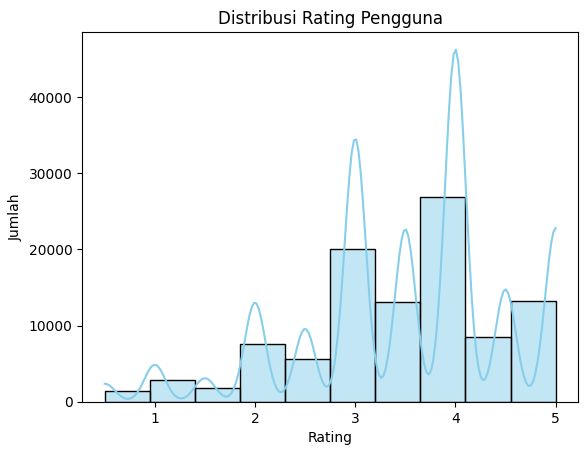
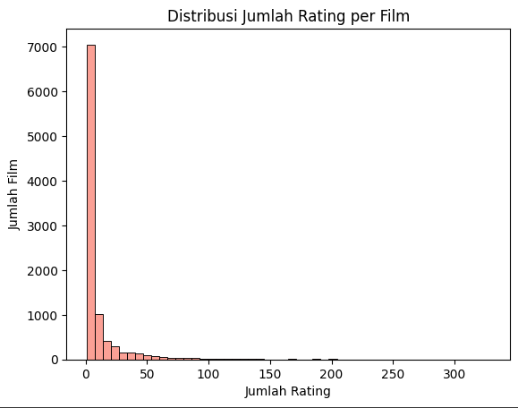
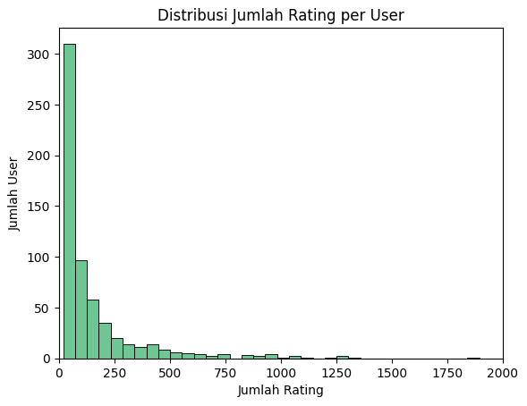
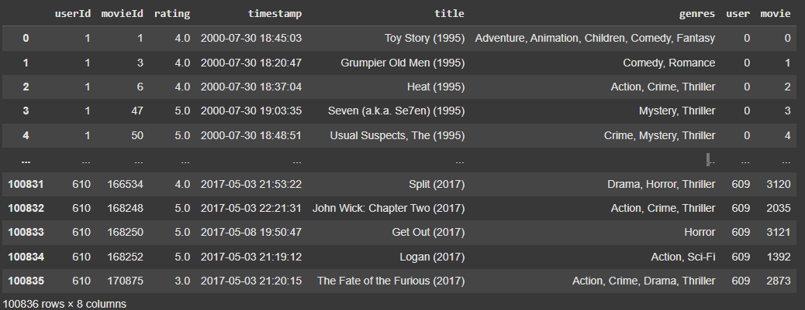
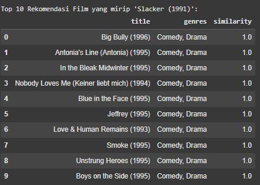
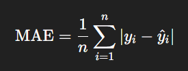
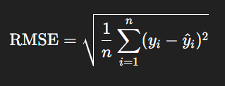
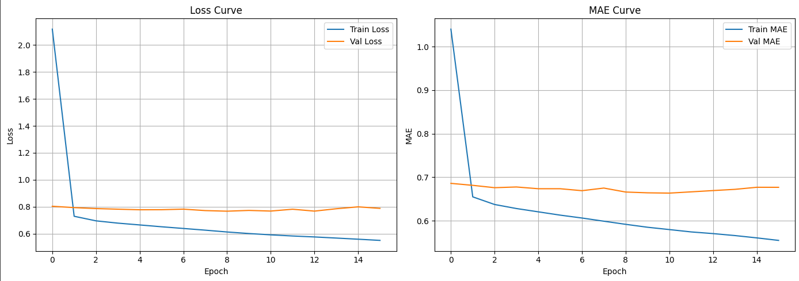

# Laporan Proyek Machine Learning - Elfin Darmawan

## Project Overview

Sistem rekomendasi telah menjadi bagian penting dalam berbagai platform digital untuk meningkatkan pengalaman pengguna. Proyek ini berfokus pada pengembangan sistem rekomendasi film dengan menggunakan dataset MovieLens Small Latest Dataset. Tujuan dari sistem ini adalah untuk menyarankan film yang relevan kepada pengguna berdasarkan preferensi dan riwayat rating mereka.

Dalam era digital saat ini, konsumen dihadapkan pada pilihan film yang sangat banyak, baik melalui platform streaming maupun layanan digital lainnya. Tanpa bantuan sistem rekomendasi, konsumen akan kesulitan menemukan film yang sesuai dengan preferensinya. Oleh karena itu, sistem rekomendasi menjadi solusi penting untuk membantu pengguna menemukan film yang relevan dan menarik.

### Mengapa Proyek Ini Penting?

- Membantu pengguna menemukan film yang sesuai selera mereka dari ribuan pilihan.
- Menyediakan pengalaman pengguna yang lebih baik dan personal.
- Menyarankan film-film berdasarkan preferensi pengguna

### Referensi:

Rida, M., Fatima, S., & Fatima, S. (2024). *Content based filtering and collaborative filtering: A comparative study*. ResearchGate. https://www.researchgate.net/publication/378841543_Content_Based_Filtering_And_Collaborative_Filtering_A_Comparative_Study

Aziz, A., & Rahman, M. (2023). *Evaluating performances of content-based and collaborative filtering. Oxford Journal of Data Science*. https://www.oxjournal.org/content-based-collaborative-filtering/

Singh, A., & Garg, H. (2022). *A systematic review and research perspective on recommender systems. Journal of Big Data, 9*(1), 1–40. https://journalofbigdata.springeropen.com/articles/10.1186/s40537-022-00592-5

## Business Understanding
### Problem Statements

Pengguna sering kali kesulitan memilih film yang sesuai dengan preferensi mereka karena banyaknya pilihan yang tersedia. Tanpa bantuan sistem yang cerdas, pengguna bisa merasa kewalahan dan akhirnya tidak mendapatkan pengalaman menonton yang optimal. Oleh karena itu, diperlukan sistem yang mampu merekomendasikan film secara akurat berdasarkan kemiripan isi film dan minat pengguna. 

### Goals

Membangun sistem rekomendasi yang mampu memberikan Top-N rekomendasi film yang sesuai dengan minat pengguna secara otomatis dan personal. Selain itu, mendukung pengguna dalam mengeksplorasi film baru yang sesuai dengan selera mereka.

### Solution statements

Proyek ini mengimplementasikan dua pendekatan:
- **Content-Based Filtering (TF-IDF + Cosine Similarity)**
Menggunakan informasi genre dari film untuk merekomendasikan film serupa berdasarkan kesukaan pengguna.
- **Collaborative Filtering (Neural Network-based Embedding Model)**
Menggunakan data rating untuk menemukan hubungan antar pengguna dan item untuk menampilkan rekomendasi film yang kemungkinan akan disukai oleh pengguna.


## Data Understanding

Dataset yang digunakan dalam proyek ini adalah MovieLens Small Latest Dataset, yang merupakan salah satu dataset benchmark populer untuk membangun dan mengevaluasi sistem rekomendasi. Dataset ini terdiri dari beberapa file utama, yaitu movies.csv, ratings.csv, links.csv, tags.csv. Tapi disini kita hanya menggunakan 2 dataset yaitu movies.csv dan ratings.csv.

Dataset: https://www.kaggle.com/datasets/shubhammehta21/movie-lens-small-latest-dataset

### Variabel-variabel pada `movies.csv` dataset adalah sebagai berikut:
**Terdiri dari `9.742 baris` dan `3 kolom`**

Berisi daftar film yang mencakup:
- `movieId`: ID unik untuk setiap film.
- `title`: Judul film beserta tahun rilis.
- `genres`: Daftar genre film yang dipisahkan oleh tanda pipe (|), seperti Action|Adventure|Sci-Fi.
       
### Variabel-variabel pada `ratings.csv` dataset adalah sebagai berikut:
**Terdiri dari `100.836 baris` dan `4 kolom`**

Berisi data penilaian yang diberikan pengguna terhadap film. Setiap entri menunjukkan interaksi pengguna dengan suatu film:
- `userId`: ID pengguna.
- `movieId`: ID film.
- `rating`: Nilai rating yang diberikan (skala 0.5 hingga 5.0).
- `timestamp`: Waktu rating diberikan (dalam UNIX time).

### Exploratory Data Analysis (EDA)
#### Movies Variabel
- Menampilkan 10 data awal dari dataframe movies menggunakan `.head(10)`
```
     movieId	        title	                                        genres
0	1	Toy Story (1995)	                Adventure|Animation|Children|Comedy|Fantasy
1	2	Jumanji (1995)	                        Adventure|Children|Fantasy
2	3	Grumpier Old Men (1995)	                Comedy|Romance
3	4	Waiting to Exhale (1995)	        Comedy|Drama|Romance
4	5	Father of the Bride Part II (1995)	Comedy
5	6	Heat (1995)	                        Action|Crime|Thriller
6	7	Sabrina (1995)	                        Comedy|Romance
7	8	Tom and Huck (1995)	                Adventure|Children
8	9	Sudden Death (1995)	                Action
9	10	GoldenEye (1995)	                Action|Adventure|Thriller
```
Tabel diatas merupakan isi dari dataset `movie.csv` dengan menampilkan 10 data awal dari dataset tersebut.

- Menampilkan dan mengecek informasi umum dataset menggunakan `.info`
```
<class 'pandas.core.frame.DataFrame'>
RangeIndex: 9742 entries, 0 to 9741
Data columns (total 3 columns):
 #   Column   Non-Null Count  Dtype 
---  ------   --------------  ----- 
 0   movieId  9742 non-null   int64 
 1   title    9742 non-null   object
 2   genres   9742 non-null   object
dtypes: int64(1), object(2)
memory usage: 228.5+ KB
```
Pada setiap kolom tertera 9742 non-null, yang menunjukan bahwa tidak ada nilai yang hilang atau mising value pada dataset. Kolom `movieId` memiliki tipe data integer, sedangkan `title` dan `genres` memiliki tipe data object.

- Melihat statistik deskriptif dari dataset menggunakan `.describe`
```bash
          movieId
count	9742.000000
mean	42200.353623
std	52160.494854
min	1.000000
25%	3248.250000
50%	7300.000000
75%	76232.000000
max	193609.000000
```
Karena dalam dataset `movies` hanya kolom `movieId` yang bersifat numerik, maka outputnya hanya menampilkan statistik untuk kolom tersebut. Terlihat nilai tengah, standar deviasi, minimal dan maximal untuk kolom `movieId`.

- Mengecek Missing Value dan data duplikat menggunakan `.isnull().sum()` dan `.duplicated().sum()`
```bash
        0
movieId	0
title	0
genres	0
dtype: int64 
```
Dari pengecekan tersebut terlihat bahwa tidak ada nilai null atau kosong dari dataframe movies

```bash
Jumlah data duplikat: 0
```
Mengecek data duplikat pada dataframe movies dan hasilnya adalah tidak ada data duplikat

- Distribusi Jumlah Film tiap genre


Dari plot ini, kita bisa melihat genre-genre yang paling populer (memiliki jumlah film terbanyak) seperti Drama dan Comedy, hingga genre yang paling jarang seperti Film-Noir dan (no genres listed). Plot ini memberikan gambaran visual tentang komposisi genre dalam dataset film.

#### Ratings Variabel
- Menampilkan 10 data awal dari dataframe ratings menggunakan `.head(10)`
```bash
       userId	movieId	rating	timestamp
0	1	1	4.0	964982703
1	1	3	4.0	964981247
2	1	6	4.0	964982224
3	1	47	5.0	964983815
4	1	50	5.0	964982931
5	1	70	3.0	964982400
6	1	101	5.0	964980868
7	1	110	4.0	964982176
8	1	151	5.0	964984041
9	1	157	5.0	964984100
```
Tabel diatas menampilkan 10 baris pertama dari dataframe ratings.

- Menampilkan dan mengecek informasi umum dataset menggunakan `.info`
```bash
<class 'pandas.core.frame.DataFrame'>
RangeIndex: 100836 entries, 0 to 100835
Data columns (total 4 columns):
 #   Column     Non-Null Count   Dtype  
---  ------     --------------   -----  
 0   userId     100836 non-null  int64  
 1   movieId    100836 non-null  int64  
 2   rating     100836 non-null  float64
 3   timestamp  100836 non-null  int64  
dtypes: float64(1), int64(3)
```
Terlihat bahwa tiap kolom pada dataset `ratings.csv` tertera 100836 non-null, menunjukan bahwa tidak ada nilai kosong atau null pada dataset `rating.csv`. Kolom `userId`, `movieId`, `timestamp` memiliki tipe data integer, sedangkan kolom `rating` memiliki tipe data float.

- Melihat statistik deskriptif dari dataset menggunakan `.describe`
```bash
        userId	          movieId        rating	         timestamp
count	100836.000000	100836.000000	100836.000000	1.008360e+05
mean	326.127564	19435.295718	3.501557	1.205946e+09
std	182.618491	35530.987199	1.042529	2.162610e+08
min	1.000000	1.000000	0.500000	8.281246e+08
25%	177.000000	1199.000000	3.000000	1.019124e+09
50%	325.000000	2991.000000	3.500000	1.186087e+09
75%	477.000000	8122.000000	4.000000	1.435994e+09
max	610.000000	193609.000000	5.000000	1.537799e+09
```
Dari statistik tersebut, terdapat 610 pengguna unik yang berbeda dan rating cenderung berada di sekitar 3.5 dengan variasi yang cukup.

- Mengecek Missing Value dan data duplikat menggunakan `.isnull().sum()` dan `.duplicated().sum()`
```bash
                0
userId	        0
movieId         0
rating	        0
timestamp	0
dtype: int64
```
Mengecek nilai null atau kosong, dan hasilnya tidak ada nilai null pada dataset ratings

```bash
Jumlah data duplikat: 0
```
Mengecek data duplikat dan hasilnya tidak ada data yang duplikat pada dataset ratings

- Distribusi Rating Pengguna



Pada distribusi ini menunjukkan bahwa sebagian besar pengguna memberikan rating yang positif (3 ke atas), dengan fokus terbesar pada rating 4. Adanya pola bimodal (atau multimodal) menyarankan bahwa mungkin ada faktor-faktor berbeda yang mendorong pengguna untuk memberikan rating tertentu. Misalnya, rating 3 bisa jadi rating "standar yang baik", sementara rating 4 bisa jadi rating "luar biasa".

- Distribusi Jumlah Rating Per Film



Distribusi Sangat Miring ke Kanan (Right-Skewed), mayoritas film memiliki jumlah rating yang sangat sedikit. Batang histogram tertinggi berada di dekat angka 0, menunjukkan bahwa ribuan film hanya memiliki sedikit rating (mungkin 1-10 rating). Banyak Film dengan Jumlah Rating Sangat Sedikit, ada sekitar 7.000 film yang memiliki jumlah rating mendekati nol, atau sangat rendah (misalnya, di bawah 10 rating). Ini menunjukkan adanya "long tail" di mana sebagian besar film tidak mendapatkan banyak perhatian atau eksposur.

- Distribusi Jumlah Rating Per User



Distribusi Sangat Miring ke Kanan (Right-Skewed), sama seperti distribusi rating per film, distribusi jumlah rating per pengguna juga sangat miring ke kanan. Ini menunjukkan bahwa sebagian besar pengguna hanya memberikan sejumlah kecil rating. Banyak Pengguna dengan Jumlah Rating Sedikit, ada lebih dari 300 pengguna yang memberikan jumlah rating yang sangat rendah (misalnya, di bawah 100 rating). Ini menunjukkan bahwa sebagian besar pengguna mungkin merupakan pengguna "kasual" yang tidak terlalu aktif dalam memberikan rating.

## Data Preparation
Pada tahap ini adalah proses sistematis untuk mengubah data mentah menjadi bentuk yang bersih, konsisten, dan siap digunakan dalam pemodelan machine learning. Tahap ini dilakukan setelah EDA (Exploratory Data Analysis) dan sebelum pelatihan model. Banyak kasus menunjukkan bahwa model yang bagus tidak akan memberikan hasil optimal jika data yang digunakan tidak dipersiapkan dengan baik. Dari hasil EDA, kita bisa melihat apa saja yang perlu dilakukan selanjutnya agar model optimal.

### Mengubah pemisah pada kolom genre dari pipe ke koma-spasi
```python
# Ubah pemisah genre dari pipe ke koma-spasi
movies['genres'] = movies['genres'].str.replace('|', ', ', regex=False)

# Memastikan bahwa setiap entri dalam kolom 'genres' adalah string
movies['genres'] = movies['genres'].apply(lambda x: ', '.join(x) if isinstance(x, list) else str(x))
```
Baris pertama mengubah pemisah genre dari karakter pipe (|) menjadi koma-spasi (,), menjadikan setiap entri genre sebagai satu string yang dipisahkan oleh ,. Baris kedua kemudian memastikan bahwa setiap entri dalam kolom 'genres' adalah string. Jika ada entri yang masih berupa list (misalnya, jika ada langkah sebelumnya yang menghasilkan list genre), baris ini akan menggabungkannya menjadi satu string yang dipisahkan oleh koma-spasi.

### Menggabungkan dataframe `movies` dan `ratings` berdasarkan movieId
```python
# Gabungkan rating dengan info film
merged_df = ratings.merge(movies, on='movieId')
```
Penggabungan ini bertujuan untuk menyatukan data movies dan ratings dalam satu dataframe bernama `merged_df`, dataframe gabungan tersebut digunakan pada encoding dan split data untuk modeling Collaborative Filtering yaitu rekomendasi film berdasarkan rating pengguna.

### Encoding
```python
# Buat mapping unik untuk userId dan movieId
user_ids = merged_df['userId'].unique()
movie_ids = merged_df['movieId'].unique()

# Mapping dari ID asli ke encoded ID
user2user_encoded = {x: i for i, x in enumerate(user_ids)}
movie2movie_encoded = {x: i for i, x in enumerate(movie_ids)}

# Mapping dari encoded ID ke ID asli
user_encoded2user = {i: x for x, i in user2user_encoded.items()}
movie_encoded2movie = {i: x for x, i in movie2movie_encoded.items()}

# Tambahkan kolom 'user' dan 'movie' hasil encoding ke merged_df
merged_df['user'] = merged_df['userId'].map(user2user_encoded)
merged_df['movie'] = merged_df['movieId'].map(movie2movie_encoded)

# Hitung jumlah unik user dan movie (berguna untuk input size ke model)
n_users = len(user2user_encoded)
n_movies = len(movie2movie_encoded)
```
Membuat dua kamus (dictionary) yang memetakan ID asli (userId dan movieId) ke ID baru yang di-encode (bilangan bulat berurutan, dimulai dari 0) dan membuat kolom baru bernama `user` dan `movie` yang berisi versi ID yang sudah di encode.



### Data Splitting
```python
# Split data untuk model_nn
x = merged_df[['user', 'movie']].values
y = merged_df['rating'].values
x_train, x_val, y_train, y_val = train_test_split(x, y, test_size=0.2, random_state=42)
```
```bash
Ukuran data training: 80668 | Ukuran data validasi: 20168
```
Membagi data menjadi 80% data latih dan 20% data validasi, data latih digunakan untuk melatih atau membangun model dan data validasi digunakan untuk mengevaluasi model yang sudah dibangun.

## Modeling
Pada tahap ini, kita akan membangun dua jenis sistem rekomendasi yang berbeda:

### 1. Content-Based Filtering 

Merekomendasikan item berdasarkan atribut atau konten item itu sendiri. Di sini kita akan menggunakan fitur teks (genre) dan menghitung kemiripan antar film.
#### Vektorisasi Teks (TF-IDF): Mengubah teks (genre) menjadi representasi numerik yang dapat diproses oleh komputer. TF-IDF adalah teknik pembobotan statistik yang digunakan untuk mengevaluasi seberapa penting sebuah kata dalam dokumen dalam sebuah korpus. Semakin tinggi nilai TF-IDF suatu kata, semakin relevan kata tersebut terhadap dokumen tertentu dalam korpus tersebut.

$$TFIDF(t, d, D) = TF(t, d) \times IDF(t, D)$$

Di mana:
* `TFIDF(t, d, D)` adalah nilai TF-IDF untuk term `t` dalam dokumen `d` dari korpus `D`.
* `TF(t, d)` (**Term Frequency**) mengukur seberapa sering term `t` muncul dalam dokumen `d`. Semakin sering term muncul, semakin tinggi nilainya.
* `IDF(t, D)` (**Inverse Document Frequency**) mengukur seberapa penting term `t` di seluruh korpus `D`. Nilai ini lebih tinggi untuk term yang jarang muncul di seluruh korpus, menunjukkan bahwa term tersebut lebih spesifik dan diskriminatif.

#### Menghitung Kemiripan (Cosine Similarity): Setelah genre direpresentasikan sebagai vektor TF-IDF, kita dapat menghitung kemiripan antara dua film menggunakan Cosine Similarity. Cosine Similarity mengukur kosinus sudut antara dua vektor. Semakin kecil sudutnya (semakin dekat ke 0), semakin tinggi kemiripannya (nilai mendekati 1). 

$$similarity(\mathbf{A}, \mathbf{B}) = \cos(\theta) = \frac{\mathbf{A} \cdot \mathbf{B}}{\|\mathbf{A}\| \|\mathbf{B}\|} = \frac{\sum_{i=1}^{n} A_i B_i}{\sqrt{\sum_{i=1}^{n} A_i^2} \sqrt{\sum_{i=1}^{n} B_i^2}}$$

Di mana:
* $\mathbf{A}$ dan $\mathbf{B}$ adalah dua vektor yang sedang diukur kesamaannya (misalnya, vektor rating pengguna atau vektor fitur item).
* $A_i$ dan $B_i$ adalah komponen individual dari vektor $\mathbf{A}$ dan $\mathbf{B}$ pada dimensi $i$.
* $\mathbf{A} \cdot \mathbf{B}$ adalah produk titik (dot product) dari vektor $\mathbf{A}$ dan $\mathbf{B}$.
* $\|\mathbf{A}\|$ dan $\|\mathbf{B}\|$ adalah magnitudo (panjang Euclidean) dari vektor $\mathbf{A}$ dan $\mathbf{B}$.

- **Kelebihan:**
  - Tidak tergantung pada data pengguna lain.
  - Tidak rentan terhadap cold-start untuk item.

- **Kekurangan:** 
  - Tidak mampu merekomendasikan jika tidak ada metadata.
  - Tidak Mampu Merekomendasikan Item Berdasarkan Preferensi Sosial.

### 2. Collaborative Filtering

Merekomendasikan item berdasarkan preferensi pengguna lain yang mirip atau pola rating yang sama. Kita akan menggunakan pendekatan berbasis Deep Learning (Recommender Net). Model tersebut akan secara otomatis mempelajari representasi yang menangkap kesamaan antara pengguna dan item.

Parameter yang digunakan yaitu `embedding_size=20`, `embeddings_initializer=he_normal`, `Dense 1=64`, `kernel_regulizer`, `Dropout=0.3`. 

- **Kelebihan:** 
  - Memanfaatkan pola rating pengguna lain.
  - Menemukan pola kompleks antar pengguna.
  - Tidak membutuhkan metadata.
  - Top-N rekomendasi yang akurat.

- **Kekurangan:**
  - Cold start problem jika user atau item baru.
  - Butuh banyak data.
  - Lebih kompleks dan mahal secara komputasi

### Training Model
#### Content Based Filtering
Cukup menggunakan dataset movies untuk CBF, yang memliki kolom `tittle` dan `genres`
```python
# TF-IDF Vectorizer
tfidf = TfidfVectorizer()
tfidf_matrix = tfidf.fit_transform(movies['genres'])
```
Tahap ini digunakan untuk mengubah data teks (dalam hal ini, genre film) menjadi format numerik yang dapat dipahami dan diproses oleh algoritma machine learning. Teknik yang digunakan adalah TF-IDF (Term Frequency-Inverse Document Frequency) Vectorization.
```python
# Hitung cosine similarity antar film
cosine_sim = cosine_similarity(tfidf_matrix, tfidf_matrix)
```
Menghitung kemiripan kosinus (Cosine Similarity) antara semua pasangan film berdasarkan representasi TF-IDF genre.
```python
# Membuat fungsi untuk rekomendasi film berdasarkan genre
def content_based_recommend(title, top_n=10):
    idx = movies[movies['title'].str.lower() == title.lower()].index
    if idx.empty:
        return "Film tidak ditemukan."
    idx = idx[0]
    sim_scores = list(enumerate(cosine_sim[idx]))
    sim_scores = sorted(sim_scores, key=lambda x: x[1], reverse=True)
    sim_scores = sim_scores[1:top_n+1]
    movie_indices = [i[0] for i in sim_scores]
    return movies.iloc[movie_indices][['title', 'genres']]
```
Ini merupakan fungsi model untuk melihat hasil dari Modeling Content Based menggunakan TF-IDF dan cosine similarity. Selanjutnya melakukan pemanggilan fungsi untuk melihat hasil model yang telah dibuat dengan memanggil cosine_sim.

#### Collaborative Filtering (RecommenderNet)
```python
# Inisialisasi Model yang digunakan untuk Collaborative Filtering menggunakan RecomenderNet
class RecommenderNet(Model):
    def __init__(self, num_users, num_movies, embedding_size=20, **kwargs):
        super(RecommenderNet, self).__init__(**kwargs)
        self.user_embedding = Embedding(num_users, embedding_size, embeddings_initializer='he_normal')
        self.movie_embedding = Embedding(num_movies, embedding_size, embeddings_initializer='he_normal')
        self.concat = Concatenate()
        self.dense1 = Dense(64, activation='relu', kernel_regularizer=regularizers.l2(1e-4))
        self.dropout = Dropout(0.3)
        self.dense2 = Dense(1)

    def call(self, inputs):
        user_vector = self.user_embedding(inputs[:, 0])
        movie_vector = self.movie_embedding(inputs[:, 1])
        x = self.concat([user_vector, movie_vector])
        x = self.dense1(x)
        x = self.dropout(x)
        return self.dense2(x)

# Compile model
model_nn = RecommenderNet(n_users, n_movies)
model_nn.compile(
    loss='mean_squared_error',
    optimizer='adam',
    metrics=['mae']
)

# Callbacks EarlyStopping
early_stop = EarlyStopping(monitor='val_mae', patience=5, restore_best_weights=True)

# Training
history = model_nn.fit(
    x_train,
    y_train,
    epochs=100,
    batch_size=128,
    validation_data=(x_val, y_val),
    callbacks=[early_stop],
    verbose=1
)
```
Menginialisasi model untuk Collaborative Filtering menggunakan model RecommenderNet, Ukuran (dimensi) dari vektor embedding yang akan dipelajari untuk setiap pengguna dan film. Parameter yang digunakan yaitu `embedding_size=20`, `embeddings_initializer=he_normal`, `Dense 1=64`, `kernel_regulizer`, `Dropout=0.3`. Lalu melakukan training model dengan menambahkan callbacks.

### Hasil Modeling
#### Content Based Filtering
```
Top 10 Rekomendasi Film yang mirip 'Slacker (1991)':

                                          title         genres
67                             Big Bully (1996)  Comedy, Drama
74              Antonia's Line (Antonia) (1995)  Comedy, Drama
85                In the Bleak Midwinter (1995)  Comedy, Drama
94   Nobody Loves Me (Keiner liebt mich) (1994)  Comedy, Drama
129                     Blue in the Face (1995)  Comedy, Drama
143                              Jeffrey (1995)  Comedy, Drama
150                 Love & Human Remains (1993)  Comedy, Drama
164                                Smoke (1995)  Comedy, Drama
173                      Unstrung Heroes (1995)  Comedy, Drama
186                     Boys on the Side (1995)  Comedy, Drama
```
Diatas adalah demonstrasi fungsional dari sistem rekomendasi film berbasis genre yang dibangun. Ini menunjukkan bahwa ketika kita meminta rekomendasi untuk Film berjudul "Slacker (1991)", sistem berhasil mengidentifikasi dan menampilkan 10 film lain yang memiliki profil genre yang sangat serupa, memvalidasi bahwa fungsi model yang dibangun bekerja sesuai harapan.

#### Collaborative Filtering
```
🎬 Rekomendasi untuk User ID: 5
[INFO] Total film belum ditonton: 9680
10 film yang direkomendasikan (yang belum ditonton):

                     title	                                        genres
1	Henry Fool (1997)	                                   Comedy, Drama
2	Lord of the Rings: The Fellowship of the Ring,...	   Adventure, Fantasy
3	City of God (Cidade de Deus) (2002)	                   Action, Adventure, Crime, Drama, Thriller
4	All the President's Men (1976)	                           Drama, Thriller
5	Human Condition III, The (Ningen no joken III)...	   Drama, War
6	Unfinished Life, An (2005)	                           Drama
7	Thank You for Smoking (2006)	                           Comedy, Drama
8	I'm Not There (2007)	                                   Drama
9	Sound of the Mountain (Thunder of the Mountain...	   Drama
10	Ricky Gervais Live: Animals (2003)	                   Comedy
```
Hasil ini menunjukkan bahwa model Collaborative Filtering telah berhasil mengeluarkan 10 film yang belum ditonton oleh `User ID 5`, namun diprediksi memiliki rating tinggi jika ditonton. Total film yang belum ditonton oleh user adalah 9680. Film-film yang direkomendasikan mencakup berbagai genre, namun dari hasil tersebut didominasi oleh film yang mengandung genre `Drama`. Hal ini mengindikasikan bahwa user ini atau user-user yang mirip dengannya menyukai film yang realistis dan emosional. Jika User ID 5 memiliki pola preferensi yang mirip dengan pengguna lain yang menyukai film-film ini, maka film-film ini akan direkomendasikan.

## Evaluation
### Content Based Filtering
Untuk evaluasi model Content Based Filtering, hampir sama menggunakan output model diatas tetapi hanya beda film. Sehingga menentukan precision secara manual berdasarkan genre yang sama dengan film tersebut.

```python
def get_genre_only_recommendations_df(movie_title, movies_df, cosine_sim, top_n=10):
    # Cari index film berdasarkan judul (tanpa case sensitivity)
    indices = movies_df[movies_df['title'].str.lower() == movie_title.lower()].index
    if indices.empty:
        print(f"Film '{movie_title}' tidak ditemukan.")
        return pd.DataFrame(columns=['title', 'genres', 'similarity'])

    idx = indices[0]

    # Hitung skor kemiripan
    sim_scores = list(enumerate(cosine_sim[idx]))
    sim_scores = sorted(sim_scores, key=lambda x: x[1], reverse=True)

    # Ambil top_n hasil teratas (kecuali film itu sendiri)
    sim_scores = sim_scores[1:top_n+1]
    movie_indices = [i for i, _ in sim_scores]
    similarity_scores = [score for _, score in sim_scores]

    # Ambil data film yang direkomendasikan
    recommended = movies_df.iloc[movie_indices][['title', 'genres']].copy()
    recommended['similarity'] = similarity_scores

    # Reset index agar rapi
    recommended.reset_index(drop=True, inplace=True)

    return recommended
```
```python
recommended_df = get_genre_only_recommendations_df("Slacker (1991)", movies, cosine_sim)
print("\nTop 10 Rekomendasi Film yang mirip 'Slacker (1991)':")
display(recommended_df)
```


$$Precision = \frac{\text{Jumlah rekomendasi yang relevan}}{\text{Jumlah item yang direkomendasikan}} = \frac{10}{10} = 100%$$

Precision = 10/10 = **100%**

Dari hasil evaluasi diatas, bisa dilihat bahwa precision yang didapatkan adalah **100%**, karena film `Slacker (1991)` bergenre Action, Crime, Thriller. Rekomendasi film yang muncul memliki genre yang sama persis dengan `Slacker (1991)` dengan `similarity 1.0` (Tertinggi) dan jumlah film yang memiliki genre sama adalah 10/10 atau **100%**. Sehingga model tersebut sangat baik untuk memberikan rekomendasi film berdasarkan genre yang disukai oleh pengguna.

### Collaborative Filtering
#### 1. Mean Absolute Error (MAE)
MAE mengukur rata-rata dari selisih absolut antara nilai yang diprediksi dan nilai aktual. Dengan kata lain, ini adalah rata-rata besarnya kesalahan tanpa mempertimbangkan arahnya (apakah prediksi terlalu tinggi atau terlalu rendah).



#### 2. Root Mean Squared Error (RMSE)
RMSE mengukur akar kuadrat dari rata-rata kuadrat selisih antara nilai yang diprediksi dan nilai aktual. Dengan mengkuadratkan selisih, RMSE memberikan bobot yang lebih besar pada kesalahan yang lebih besar.



```bash
Evaluasi Model:
MAE  (Mean Absolute Error): 0.6634
RMSE (Root Mean Squared Error): 0.8745
```
1. **MAE (Mean Absolute Error):**
   - Artinya, rata-rata selisih absolut antara rating yang diprediksi model dan rating asli pengguna adalah sekitar 0.6634.
   - Dalam konteks rating film (biasanya skala 0–5), ini cukup baik, karena model hanya salah prediksi sekitar ±0.66 poin dari nilai sebenarnya.

3. **RMSE (Root Mean Squared Error):**
   - RMSE lebih sensitif terhadap kesalahan besar, karena selisih dikuadratkan.
   - Nilai 0.8745 menunjukkan prediksi cukup konsisten.
   - Idealnya, RMSE tidak terlalu jauh dari MAE, dan dalam kasus ini selisih kecil (≈0.21), yang berarti tidak banyak kesalahan prediksi ekstrem.

#### Visualisasi Loss dan MAE



- Train Loss & MAE terus menurun seiring bertambahnya epoch, sehingga model terus belajar dari data training.
- Validation Loss & MAE stagnan atau sedikit naik setelah beberapa epoch, sehingga model mulai kehilangan kemampuan generalisasi ke data yang tidak dilatih.
- Terdapat gap antara nilai training dan validation (baik loss maupun MAE).

## Kesimpulan
Proyek ini berhasil mengembangkan sistem rekomendasi film yang mampu menyarankan Top-N film yang relevan bagi pengguna berdasarkan preferensi dan riwayat interaksi mereka. Dua pendekatan yang diterapkan telah memenuhi permasalahan dengan mengembangkan solution statements yaitu membangun model sistem rekomendasi Content-Based Filtering (TF-IDF dan Cosine Similarity) dan Collaborative Filtering berbasis Neural Network mampu memberikan rekomendasi dengan keunggulan masing-masing.

- Content-Based Filtering efektif dalam memberikan rekomendasi yang konsisten dan relevan secara tematik berdasarkan genre film yang disukai pengguna. Pendekatan ini cocok untuk pengguna baru, namun cenderung memberikan saran yang terlalu mirip dengan preferensi sebelumnya (kurang eksploratif).
- Collaborative Filtering menggunakan embedding model untuk mempelajari pola laten dari data rating. Pendekatan ini mampu memberikan saran yang lebih bervariasi dan cukup akurat bagi pengguna yang memiliki riwayat interaksi cukup, meskipun menghadapi tantangan pada cold-start problem.

Hasil evaluasi menunjukkan bahwa kedua pendekatan dapat saling melengkapi. Dengan kombinasi pendekatan berbasis konten dan perilaku pengguna, sistem rekomendasi yang dikembangkan mampu meningkatkan personalisasi dan pengalaman pengguna secara keseluruhan. Sehingga proyek ini sudah mencapai goalsnya yaitu memberikan rekomendasi film Top-N Rekomendasi Film berdasarkan film atau genre kesukaan dan minat secara personal.

## Rekomendasi
- Meningkatkan kembali model Collaborative Filtering agar lebih presisi untuk memprediksi.
- Tuning Hyperparameter Model:
  - Ukuran embedding layer.
  - Penambahan dropout/regularizer.
  - Ukuran batch dan learning rate.
- Model yang lebih kompleks dapat meningkatkan akurasi
- Menggunakan Hybrid Filtering, yaitu menggabungkan 2 model content based dan collaborative.
